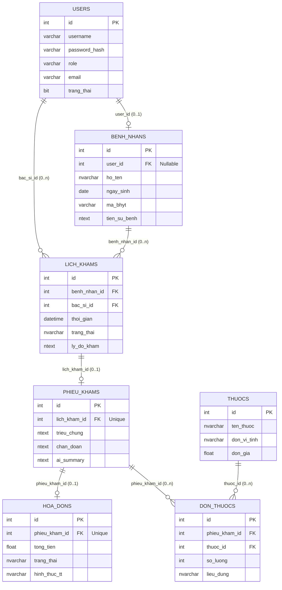

# MỤC 4.8.3: BIỂU ĐỒ THỰC THỂ QUAN HỆ (ERD) — HỆ THỐNG HOSPITAL-AI

Tài liệu này chuẩn hóa và vẽ lại toàn bộ **Hình 21: Biểu đồ ERD** thuộc **Mục 4.8.3** trong tài liệu SRS Báo cáo của **Nhóm 03**, đảm bảo:
1. **Khớp 100%** với danh mục các bảng dữ liệu đã định nghĩa tại **Mục 4.8.1 (Bảng 35 đến Bảng 41)**.
2. **Khớp 100%** với cấu trúc CSDL thực tế trong mã nguồn backend (`models.py`).
3. **Sửa toàn bộ lỗi sai về bản số (Cardinality)** trong biểu đồ cũ (thay thế các quan hệ 1-1 cưỡng bức sai nghiệp vụ thành `0..1` Optional).
4. **File ảnh chất lượng cao:** File ảnh chuẩn độ phân giải 4K (300 DPI) đã được xuất ra tại file [ERD.png](file:///e:/BAI_TAP/HOC-KY-7/project_AI/hospital-ai/ERD.png) để chèn trực tiếp vào báo cáo Word.

---

## 1. HÌNH ẢNH BIỂU ĐỒ ERD CHUẨN HÓA (HÌNH 21)

> *File ảnh gốc đính kèm:* **`ERD.png`** (Độ phân giải cao 300 DPI, sẵn sàng copy/paste vào Word).

---

## 2. BẢNG CHI TIẾT CÁC THỰC THỂ VÀ THUỘC TÍNH (CHUẨN 4.8.1)

### 1. Thực thể `Users` (Tài khoản người dùng)
- **id** (`int`, PK): Khóa chính tự tăng.
- **username** (`varchar(50)`): Tên đăng nhập hệ thống.
- **password_hash** (`varchar(255)`): Mật khẩu băm bảo mật (Argon2 / BCrypt).
- **role** (`varchar(20)`): Vai trò hệ thống (`ADMIN`, `DOCTOR`, `RECEPTIONIST`, `ACCOUNTANT`, `PATIENT`).
- **email** (`varchar(100)`): Email liên hệ/nhận thông báo.
- **trang_thai** (`bit` / `boolean`): Trạng thái hoạt động (1: Hoạt động, 0: Khóa).

### 2. Thực thể `BenhNhans` (Hồ sơ bệnh nhân)
- **id** (`int`, PK): Khóa chính định danh bệnh nhân.
- **user_id** (`int`, FK, Nullable): Khóa ngoại liên kết tới `Users.id` (Bệnh nhân có thể đăng ký tài khoản portal hoặc khám vãng lai không cần tài khoản).
- **ho_ten** (`nvarchar(100)`): Họ và tên đầy đủ của bệnh nhân.
- **ngay_sinh** (`date`): Ngày tháng năm sinh.
- **ma_bhyt** (`varchar(20)`): Mã số thẻ Bảo hiểm Y tế.
- **tien_su_benh** (`ntext`): Tiền sử bệnh lý, dị ứng thuốc.

### 3. Thực thể `LichKhams` (Lịch hẹn khám bệnh)
- **id** (`int`, PK): Khóa chính lịch khám.
- **benh_nhan_id** (`int`, FK): Khóa ngoại tham chiếu đến `BenhNhans.id`.
- **bac_si_id** (`int`, FK): Khóa ngoại tham chiếu đến `Users.id` (bác sĩ được phân công).
- **thoi_gian** (`datetime`): Thời gian hẹn khám dự kiến.
- **trang_thai** (`nvarchar(30)`): Trạng thái lịch hẹn (`CHO_KHAM`, `DANG_KHAM`, `HOAN_THANH`, `DA_HUY`).
- **ly_do_kham** (`ntext`): Lý do đăng ký khám, mô tả ban đầu của người bệnh.

### 4. Thực thể `PhieuKhams` (Phiếu kết quả khám bệnh)
- **id** (`int`, PK): Khóa chính phiếu khám.
- **lich_kham_id** (`int`, FK, Unique): Khóa ngoại duy nhất tham chiếu đến `LichKhams.id`.
- **trieu_chung** (`ntext`): Triệu chứng lâm sàng ghi nhận bởi bác sĩ.
- **chan_doan** (`ntext`): Kết luận chẩn đoán bệnh của bác sĩ.
- **ai_summary** (`ntext`): Tóm tắt bệnh án, dặn dò hướng dẫn sau khám do AI tạo tự động.

### 5. Thực thể `HoaDons` (Hóa đơn viện phí)
- **id** (`int`, PK): Khóa chính hóa đơn thanh toán.
- **phieu_kham_id** (`int`, FK, Unique): Khóa ngoại tham chiếu đến `PhieuKhams.id`.
- **tong_tien** (`float`): Tổng số tiền thanh toán (tiền khám + tiền thuốc).
- **trang_thai** (`nvarchar(30)`): Trạng thái thanh toán (`CHO_THANH_TOAN`, `DA_THANH_TOAN`).
- **hinh_thuc_tt** (`nvarchar(50)`): Hình thức chi trả (`TIEN_MAT`, `CHUYEN_KHOAN`, `VNPAY`).

### 6. Thực thể `Thuocs` (Danh mục dược phẩm)
- **id** (`int`, PK): Khóa chính mã thuốc.
- **ten_thuoc** (`nvarchar(100)`): Tên biệt dược / tên hoạt chất.
- **don_vi_tinh** (`nvarchar(20)`): Đơn vị tính (`Viên`, `Vỉ`, `Hộp`, `Lọ`, `Gói`).
- **don_gia** (`float`): Đơn giá bán lẻ niêm yết.

### 7. Thực thể `DonThuocs` (Chi tiết đơn thuốc kê cho bệnh nhân)
- **id** (`int`, PK): Khóa chính bản ghi đơn thuốc.
- **phieu_kham_id** (`int`, FK): Khóa ngoại tham chiếu đến `PhieuKhams.id`.
- **thuoc_id** (`int`, FK): Khóa ngoại tham chiếu đến `Thuocs.id`.
- **so_luong** (`int`): Số lượng thuốc kê theo đơn vị tính.
- **lieu_dung** (`nvarchar(100)`): Hướng dẫn liều lượng và cách uống/dùng thuốc.

---

## 3. GIẢI THÍCH CHI TIẾT BẢN SỐ QUAN HỆ (CARDINALITY)

| Quan hệ giữa các thực thể | Bản số (Cardinality) | Khóa ngoại (FK) | Ý nghĩa nghiệp vụ thực tế |
| :--- | :---: | :--- | :--- |
| **`Users` — `BenhNhans`** | **`1` — `0..1`** | `user_id` | Một tài khoản người dùng có thể liên kết với tối đa 1 hồ sơ bệnh nhân (hoặc không nếu là tài khoản Bác sĩ/Admin). Bệnh nhân đến khám trực tiếp không bắt buộc phải tạo tài khoản. |
| **`BenhNhans` — `LichKhams`** | **`1` — `0..n`** | `benh_nhan_id` | Một bệnh nhân có thể đặt nhiều lịch hẹn khám ở các thời điểm khác nhau. |
| **`Users` (Bác sĩ) — `LichKhams`**| **`1` — `0..n`** | `bac_si_id` | Một bác sĩ phụ trách khám cho nhiều lịch hẹn của các bệnh nhân. |
| **`LichKhams` — `PhieuKhams`** | **`1` — `0..1`** | `lich_kham_id` | *(Đã sửa lỗi 1-1 cứng)* Khi mới đặt lịch khám thì **chưa có phiếu khám**. Chỉ khi bác sĩ bắt đầu khám mới lập 1 phiếu khám duy nhất tương ứng với lịch đó. |
| **`PhieuKhams` — `HoaDons`** | **`1` — `0..1`** | `phieu_kham_id` | *(Đã sửa lỗi 1-1 cứng)* Khi đang khám thì chưa phát sinh hóa đơn. Chỉ khi kết thúc buổi khám và kê đơn thì mới xuất hóa đơn thanh toán. |
| **`PhieuKhams` — `DonThuocs`** | **`1` — `0..n`** | `phieu_kham_id` | Một phiếu khám có thể kê đơn nhiều loại thuốc khác nhau (hoặc không kê thuốc nếu chỉ khám tư vấn). |
| **`Thuocs` — `DonThuocs`** | **`1` — `0..n`** | `thuoc_id` | Một loại thuốc trong danh mục dược phẩm có thể xuất hiện trong nhiều đơn thuốc của các bệnh nhân khác nhau. |

---

## 4. MÃ NGUỒN BIỂU ĐỒ MERMAID (DÙNG CHO TÀI LIỆU MARKDOWN / NOTION)

